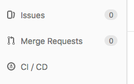

The Goal of this practical is to learn how to build your own pipeline with nextflow and using the tools already *wrapped*.
For this we are going to build a small RNASeq analysis pipeline that should run the following steps:

- remove Illumina adaptors
- trim reads by quality
- build the index of a reference genome
- estimate the number of RNA fragments mapping to the transcript of this genome

# Initialize your own project

You are going to build a pipeline for you or your team. So the first step is to create your own project.

## Forking

Instead of reinventing the wheel, you can use the [pipelines/nextflow](https://gitlab.biologie.ens-lyon.fr/pipelines/nextflow) as a template.
To easily do so, go to the [pipelines/nextflow](https://gitlab.biologie.ens-lyon.fr/pipelines/nextflow) repository and click on the [**fork**](https://gitlab.biologie.ens-lyon.fr/pipelines/nextflow/forks/new) button.


In git, the [action of forking](https://git-scm.com/book/en/v2/GitHub-Contributing-to-a-Project) means that you are going to make your own private copy of a repository. You can then write modifications in your project, and if they are of interest for the source repository (here [pipelines/nextflow](https://gitlab.biologie.ens-lyon.fr/pipelines/nextflow)) create a merge request. Merge request are send to the source repository to ask the maintainers to integrate modifications.



## Project organisation

This project (and yours) follow the [guide of good practices for the LBMC](http://www.ens-lyon.fr/LBMC/intranet/services-communs/pole-bioinformatique/ressources/good_practice_LBMC)

You are now on the main page of your fork of the [pipelines/nextflow](https://gitlab.biologie.ens-lyon.fr/pipelines/nextflow). You can explore this project, all the code in it is under the CeCILL lience (in the [LICENCE](https://gitlab.biologie.ens-lyon.fr/pipelines/nextflow/blob/master/LICENSE) file).

The [README.md](https://gitlab.biologie.ens-lyon.fr/pipelines/nextflow/blob/master/README.md) file contains instructions to run your pipeline and test it's installation.

The [CONTRIBUTING.md](https://gitlab.biologie.ens-lyon.fr/pipelines/nextflow/blob/master/CONTRIBUTING.md) file contains guidelines to follow if you want to contribute to the [pipelines/nextflow](https://gitlab.biologie.ens-lyon.fr/pipelines/nextflow) (making a merge request for example).

The [data](https://gitlab.biologie.ens-lyon.fr/pipelines/nextflow/tree/master/data) folder will be the place were you store the raw data for your analysis.
The [results](https://gitlab.biologie.ens-lyon.fr/pipelines/nextflow/tree/master/results) folder will be the place were you store the results of your analysis.
Note that the content of these two folders should never be saved on git.

The [doc](https://gitlab.biologie.ens-lyon.fr/pipelines/nextflow/tree/master/doc) folder contains the documentation of this practical course.

And most interestingly for you, the [src](https://gitlab.biologie.ens-lyon.fr/pipelines/nextflow/tree/master/src) contains code to wrapp tools. This folder contains two subdirectory. A `docker_modules`, an `nf_modules` and an `sge_modules` folder. 

### `docker_modules`

The `src/docker_modules` contains the code to wrapp tools in [Docker](https://www.docker.com/what-docker). [Docker](https://www.docker.com/what-docker) is a framework that allow you to execute software withing [containers](https://www.docker.com/what-container). The `docker_modules` contains directory corresponding to tools and subdirectories corresponding to their version.

```sh
ls -l src/docker_modules/
rwxr-xr-x  3 laurent  _lpoperator   96 May 25 15:42 BEDtools/
drwxr-xr-x  4 laurent  _lpoperator  128 Jun  5 16:14 Bowtie2/
drwxr-xr-x  3 laurent  _lpoperator   96 May 25 15:42 FastQC/
drwxr-xr-x  4 laurent  _lpoperator  128 Jun  5 16:14 HTSeq/
```

To each `tools/version` corresponds two files:

```sh
ls -l src/docker_modules/Bowtie2/2.3.4.1/
-rw-r--r--  1 laurent  _lpoperator  283 Jun  5 15:07 Dockerfile
-rwxr-xr-x  1 laurent  _lpoperator   79 Jun  5 16:18 docker_init.sh*
```

The `Dockerfile` is the [Docker](https://www.docker.com/what-docker) recepi to create a [container](https://www.docker.com/what-container) containing `Bowtie2` in it's `2.3.4.1` version. And the `docker_init.sh` file is a small script to create the [container](https://www.docker.com/what-container) from this recipe.

By running this script you will be able to easily install tools in different version on your personnal computer and use it in your pipeline. Some of the advantages are:

- Whatever the computer, the installation and the results will be the same
- You can keep [container](https://www.docker.com/what-container) for old version of tools and run it on new systems (science = reproducibility)
- You don't have to bother with detious installation procedure, somebody else already did the job and wrote a `Dockerfile`.
- You can easly keep [container](https://www.docker.com/what-container) for differents version of the sam tools.


 


