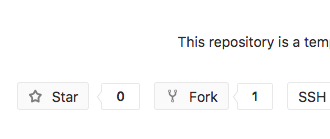

The Goal of this practical is to learn how to build your own pipeline with nextflow and using the tools already *wrapped*.
For this we are going to build a small RNASeq analysis pipeline that should run the following steps:

- remove Illumina adaptors
- trim reads by quality
- build the index of a reference genome
- estimate the amount of RNA fragments mapping to the transcripts of this genome

# Initialize your own project

You are going to build a pipeline for you or your team. So the first step is to create your own project.

## Forking

Instead of reinventing the wheel, you can use the [pipelines/nextflow](https://gitlab.biologie.ens-lyon.fr/pipelines/nextflow) as a template.
To easily do so, go to the [pipelines/nextflow](https://gitlab.biologie.ens-lyon.fr/pipelines/nextflow) repository and click on the [**fork**](https://gitlab.biologie.ens-lyon.fr/pipelines/nextflow/forks/new) button.



In git, the [action of forking](https://git-scm.com/book/en/v2/GitHub-Contributing-to-a-Project) means that you are going to make your own private copy of a repository. You can then write modifications in your project, and if they are of interest for the source repository (here [pipelines/nextflow](https://gitlab.biologie.ens-lyon.fr/pipelines/nextflow)) create a merge request. Merge requests are sent to the source repository to ask the maintainers to integrate modifications.


## Project organisation

This project (and yours) follows the [guide of good practices for the LBMC](http://www.ens-lyon.fr/LBMC/intranet/services-communs/pole-bioinformatique/ressources/good_practice_LBMC)

You are now on the main page of your fork of the [pipelines/nextflow](https://gitlab.biologie.ens-lyon.fr/pipelines/nextflow). You can explore this project, all the code in it is under the CeCILL licence (in the [LICENCE](https://gitlab.biologie.ens-lyon.fr/pipelines/nextflow/blob/master/LICENSE) file).

The [README.md](https://gitlab.biologie.ens-lyon.fr/pipelines/nextflow/blob/master/README.md) file contains instructions to run your pipeline and test its installation.

The [CONTRIBUTING.md](https://gitlab.biologie.ens-lyon.fr/pipelines/nextflow/blob/master/CONTRIBUTING.md) file contains guidelines to follow if you want to contribute to the [pipelines/nextflow](https://gitlab.biologie.ens-lyon.fr/pipelines/nextflow) (making a merge request for example).

The [data](https://gitlab.biologie.ens-lyon.fr/pipelines/nextflow/tree/master/data) folder will be the place where you store the raw data for your analysis.
The [results](https://gitlab.biologie.ens-lyon.fr/pipelines/nextflow/tree/master/results) folder will be the place where you store the results of your analysis.
Note that the content of these two folders should never be saved on git.

The [doc](https://gitlab.biologie.ens-lyon.fr/pipelines/nextflow/tree/master/doc) folder contains the documentation of this practical course.

And most interestingly for you, the [src](https://gitlab.biologie.ens-lyon.fr/pipelines/nextflow/tree/master/src) contains code to wrap tools. This folder contains two subdirectories. A `docker_modules`, a `nf_modules` and a `sge_modules` folder. 

### `docker_modules`

The `src/docker_modules` contains the code to wrap tools in [Docker](https://www.docker.com/what-docker). [Docker](https://www.docker.com/what-docker) is a framework that allows you to execute software within [containers](https://www.docker.com/what-container). The `docker_modules` contains directory corresponding to tools and subdirectories corresponding to their version.

```sh
ls -l src/docker_modules/
rwxr-xr-x  3 laurent _lpoperator   96 May 25 15:42 BEDtools/
drwxr-xr-x  4 laurent _lpoperator  128 Jun 5 16:14 Bowtie2/
drwxr-xr-x  3 laurent _lpoperator   96 May 25 15:42 FastQC/
drwxr-xr-x  4 laurent _lpoperator  128 Jun 5 16:14 HTSeq/
```

To each `tools/version` corresponds two files:

```sh
ls -l src/docker_modules/Bowtie2/2.3.4.1/
-rw-r--r-- 1 laurent _lpoperator  283 Jun  5 15:07 Dockerfile
-rwxr-xr-x  1 laurent _lpoperator   79 Jun 5 16:18 docker_init.sh*
```

The `Dockerfile` is the [Docker](https://www.docker.com/what-docker) recipe to create a [container](https://www.docker.com/what-container) containing `Bowtie2` in its `2.3.4.1` version. And the `docker_init.sh` file is a small script to create the [container](https://www.docker.com/what-container) from this recipe.

By running this script you will be able to easily install tools in different versions on your personal computer and use it in your pipeline. Some of the advantages are:

- Whatever the computer, the installation and the results will be the same
- You can keep [container](https://www.docker.com/what-container) for old version of tools and run it on new systems (science = reproducibility)
- You don’t have to bother with tedious installation procedures, somebody else already did the job and wrote a `Dockerfile`.
- You can easily keep [containers](https://www.docker.com/what-container) for different version of the same tools.

### `sge_modules`

The `src/sge_modules` folder is not really there. It’s a submodule of the project [PSMN/modules](https://gitlab.biologie.ens-lyon.fr/PSMN/modules). To populate it locally you can use the following command:

```sh
git submodule init
```

Like the `src/docker_modules` the [PSMN/modules](https://gitlab.biologie.ens-lyon.fr/PSMN/modules) project describe recipes to install tools and use them. The main difference is that you cannot use [Docker](https://www.docker.com/what-docker) on the PSMN. Instead you have to use another framework [Environment Module](http://www.ens-lyon.fr/PSMN/doku.php?id=documentation:tools:modules) which allows you to load modules for specific tools and version.
The [README.md](https://gitlab.biologie.ens-lyon.fr/PSMN/modules/blob/master/README.md) file of the [PSMN/modules](https://gitlab.biologie.ens-lyon.fr/PSMN/modules) repository contains all the instruction to be able to load the modules maintained by the LBMC and present in the [PSMN/modules](https://gitlab.biologie.ens-lyon.fr/PSMN/modules) repository.

### `nf_modules`

The `src/nf_modules` folder contains templates of [nextflow](https://www.nextflow.io/) wrappers for the tools available in [Docker](https://www.docker.com/what-docker) and [SGE](http://www.ens-lyon.fr/PSMN/doku.php?id=documentation:tools:sge). The details of the [nextflow](https://www.nextflow.io/) wrapper will be presented in the next section. Alongside the `.nf` and `.config` there is a `tests` folder that contains a `tests.sh` script to run test on the tool.

# Nextflow pipeline

A pipeline is a succession of **process**. Each process has data input(s) and optional data output(s). Data flows are modeled as **channels**.

## Processes

Here is an example of **process**:

```Groovy
process sample_fasta {
  input:
file fasta from fasta_file

  output:
file "sample.fasta" into fasta_sample

  script:
"""
head ${fasta} > sample.fasta
"""
}
```

We have the process `sample_fasta` that takes as `fasta_file` channel as input and output a `fasta_sample` channel. The process itself is defined in the `script:` block and within `"""`.

```Groovy
input:
file fasta from fasta_file
```

When we zoom on the `input:` block we see that we define a variable `fasta` of type `file` from the `fasta_file` channel. This mean that groovy is going to write a file named as the content of the variable `fasta` in the root of the folder where `script:` is executed.


```Groovy
output:
file "sample.fasta" into fasta_sample
```

At the end of the script, a file named `sample.fasta` is found in the root the folder where `script:` is executed and send into the pipeline `fasta_sample`

Using the WebIDE of Gitlab, create a file `src/fasta_sampler.nf` with this process and commit to your repository.


## Channels

Why bother with channels? In the above example, the advantages of channels are not really clear. We could have just given the `fasta` file to the process. But what if we have many fasta files to process? What if we have sub processes to run on each of the sampled fasta files? Nextflow can easily deal with these problems with the help of channels.

Channels are streams of items that are emitted by a source and consumed by a process. A process with a channel as input will be run on every item send through the channel.

```Groovy
Channel
  .fromPath( "data/tiny_dataset/fasta/*.fasta" )
  .set { fasta_file }
```

Here we defined the channel `fasta_file` that is going to send every fasta file from the folder `data/fasta/` into the process that take it as input.

Add the definition of the channel to the `src/fasta_sampler.nf` file and commit to your repository.


## Run your pipeline locally

After writing this first pipeline, you may want to test it. To do that, first clone your repository. To easily do that set the visibility level to *public* in the settings/General/Permissions page of your project.

You can then run the following commands to download your project on your computer:

```sh
git clone -c http.sslVerify=false https://gitlab.biologie.ens-lyon.fr/<usr_name>/nextflow.git
cd nextflow
src/install_nextflow.sh
```

We also need data to run our pipeline:

```
cd data
git clone -c http.sslVerify=false https://gitlab.biologie.ens-lyon.fr/LBMC/tiny_dataset.git
cd ..
```

We can run our pipeline with the following command:

```sh
./nextflow src/fasta_sampler.nf
```

## Getting your results

Our pipeline seems to work but we don’t know where is the `sample.fasta`. To get results out of a process, we need to tell nextflow to write it somewhere (we may don’t need to get every intermediate file in our results).

To do that we need to add the following line before the `input:` section:

```Groovy
publishDir "results/sampling/", mode: 'copy'
```

Every file described in the `output:` section will be copied from nextflow to the folder `results/sampling/`.

Add this to your `src/fasta_sampler.nf` file with the WebIDE and commit to your repository.
Pull your modifications locally with the command:

```sh
git pull origin master
```

You can run your pipeline again and check the content of the folder `results/sampling`.

## Fasta everywhere

We ran our pipeline on one fasta file. How nextflow would handle 100 of them? To test that we need to duplicate the `tiny_v2.fasta` file: 

```sh
for i in {1..100}
do
cp data/tiny_dataset/fasta/tiny_v2.fasta data/tiny_dataset/fasta/tiny_v2_${i}.fasta
done
```

You can run your pipeline again and check the content of the folder `results/sampling`.

Every `fasta_sampler` process write a `sample.fasta` file. We need to make the name of the output file dependent of the name of the input file.

```Groovy
output:
file "*_sample.fasta" into fasta_sample

  script:
"""
head ${fasta} > ${fasta.baseName}_sample.fasta
"""
```

Add this to your `src/fasta_sampler.nf` file with the WebIDE and commit to your repository before pulling your modifications locally.
You can run your pipeline again and check the content of the folder `results/sampling`.

# Build your own RNASeq pipeline

In this section you are going to build your own pipeline for RNASeq analysis from the code available in the `src/nf_modules` folder.

## Create your Docker containers

For this practical, we are going to need the following tools:

- For Illumina adaptor removal: cutadapt
- For reads trimming by quality: UrQt
- For mapping and quantifying reads: BEDtools and Kallisto

To initialize these tools, follow the **Installing** section of the [README.md](https://gitlab.biologie.ens-lyon.fr/pipelines/nextflow/blob/master/README.md) file.

If you are using a CBP computer don’t forget to clean up your docker containers at the end of the practical with the following command:

```sh
docker rm $(docker stop $(docker ps -aq))
docker rmi $(docker images -qf "dangling=true")
```

## Cutadapt

The first step of the pipeline is to remove any Illumina adaptor left in your read files.

Open the WebIDE and create a `src/RNASeq.nf` file. Browse for [src/nf_modules/cutadapt/cutadapt.nf](https://gitlab.biologie.ens-lyon.fr/pipelines/nextflow/blob/master/src/nf_modules/cutadapt/cutadapt.nf), this file contains examples for cutadapt. We are interested in the *Illumina adaptor removal*, *for paired-end data* section of the code. Copy this code in your pipeline and commit.

Compared to before, we have few new lines:

```Groovy
params.fastq = "$baseDir/data/fastq/*_{1,2}.fastq"
```

We declare a variable that contain the path of the fastq file to look for. The advantage of using `params.fastq` is that now the option `--fastq` in our call to the pipeline allows us to define this variable:

```sh
./nextflow src/RNASeq.nf --fastq "data/tiny_dataset/fastq/*_R{1,2}.fastq"
```

```Groovy
log.info "fastq files: ${params.fastq}"
```

This line simply displays the value of the variable

```Groovy
Channel
  .fromFilePairs( params.fastq )
```

As we are working with paired-end RNASeq data, we tell nextflow to send pairs of fastq in the `fastq_file` channel.


### cutadapt.config

For the `fastq_sampler.nf` pipeline we used the command `head` present in most base UNIX systems. Here we want to use `cutadapt` which is not. Therefore, we have three main options:

- install cutadapt locally so nextflow can use it
- launch the process in a Docker container that has cutadapt installed
- launch the process with SGE while loading the correct module to have cutadapt available

We are not going to use the first option which requires no configuration for nextflow but tedious tools installations. Instead, we are going to use existing *wrappers* and tell nextflow about it. This is what the [src/nf_modules/cutadapt/cutadapt.config](https://gitlab.biologie.ens-lyon.fr/pipelines/nextflow/blob/master/src/nf_modules/cutadapt/cutadapt.config) is used for.

Copy the content of this config file to an `src/RNASeq.config` file. This file is structured in process blocks. Here we are only interested in configuring `adaptor_removal` process not `trimming` process. So you can remove the `trimming` block and commit.

You can test your pipeline with the following command:

```sh
./nextflow src/RNASeq.nf -c src/RNASeq.config -profile docker --fastq "data/tiny_dataset/fastq/*_R{1,2}.fastq"
```


## UrQt

The second step of the pipeline is to trim reads by quality.

Browse for [src/nf_modules/UrQt/urqt.nf](https://gitlab.biologie.ens-lyon.fr/pipelines/nextflow/blob/master/src/nf_modules/UrQt/urqt.nf), this file contains examples for UrQt. We are interested in the *for paired-end data* section of the code. Copy the process section code in your pipeline and commit.

This code won’t work if you try to run it: the `fastq_file` channel is already consumed by the `adaptor_removal` process. In nextflow once a channel is used by a process, it ceases to exist. Moreover, we don’t want to trim the input fastq, we want to trim the fastq that comes from the `adaptor_removal` process.

Therefore, you need to change the line:

```Groovy
set pair_id, file(reads) from fastq_files
```

In the `trimming` process to:

```Groovy
set pair_id, file(reads) from fastq_files_cut
```

The two processes are now connected by the channel `fastq_files_cut`.

Add the content of the [src/nf_modules/UrQt/urqt.config](https://gitlab.biologie.ens-lyon.fr/pipelines/nextflow/blob/master/src/nf_modules/UrQt/urqt.config) file to your `src/RNASeq.config` file and commit.

You can test your pipeline.

## BEDtools

Kallisto need the sequences of the transcripts that need to be quantified. We are going to extract these sequences from the reference `data/tiny_dataset/fasta/tiny_v2.fasta` with the `bed` annotation `data/tiny_dataset/annot/tiny.bed`.

You can copy to your `src/RNASeq.nf` file the content of [src/nf_modules/BEDtools/bedtools.nf](https://gitlab.biologie.ens-lyon.fr/pipelines/nextflow/blob/master/src/nf_modules/BEDtools/bedtools.nf) and to your `src/RNASeq.config` file the content of [src/nf_modules/BEDtools/bedtools.config](https://gitlab.biologie.ens-lyon.fr/pipelines/nextflow/blob/master/src/nf_modules/BEDtools/bedtools.config).

Commit your work and test your pipeline with the following command:

```sh
./nextflow src/RNASeq.nf -c src/RNASeq.config -profile docker --fastq "data/tiny_dataset/fastq/*_R{1,2}.fastq" --fasta "data/tiny_dataset/fasta/tiny_v2.fasta" --bed "data/tiny_dataset/annot/tiny.bed"
```

## Kallisto

Kallisto run in two steps: the indexation of the reference and the quantification on this index.

You can copy to your `src/RNASeq.nf` file the relevant content of [src/nf_modules/Kallisto/kallisto.nf](https://gitlab.biologie.ens-lyon.fr/pipelines/nextflow/blob/master/src/nf_modules/Kallisto/kallisto.nf) and to your `src/RNASeq.config` file the content of [src/nf_modules/Kallisto/kallisto.config](https://gitlab.biologie.ens-lyon.fr/pipelines/nextflow/blob/master/src/nf_modules/Kallisto/kallisto.config).

We are going to work with paired-end so only copy the relevant processes. The `index_fasta` process needs to take as input the output of your `fasta_from_bed` process. The `fastq` input of your `mapping_fastq` process needs to take as input the output of your `index_fasta` process and the `trimming` process.

Commit your work and test your pipeline.
You now have a RNASeq analysis pipeline that can run locally with Docker!


## Additional nextflow option

With nextflow you can restart the computation of a pipeline and get a trace of the process with the following options:

```sh
 -resume -with-dag results/RNASeq_dag.pdf -with-timeline results/RNASeq_timeline
```

# Run your RNASeq pipeline on the PSMN

First you need to connect to the PSMN:

```sh
login@allo-psmn
```
Then once connected to `allo-psmn`, you can connect to `e5-2667v4comp1`:

```sh
login@e5-2667v4comp1
```

## Set your environment

Make the LBMC modules available to you:

```sh
ln -s /Xnfs/lbmcdb/common/modules/modulefiles ~/privatemodules
echo "module use ~/privatemodules" >> .bashrc
```

Then you need to clone your pipeline and get the data:

```sh
git clone -c http.sslVerify=false https://gitlab.biologie.ens-lyon.fr/lmodolo/nextflow.git
cd nextflow/data
git clone -c http.sslVerify=false https://gitlab.biologie.ens-lyon.fr/LBMC/tiny_dataset.git
cd ..
```

## Run nextflow

As we don’t want nextflow to be killed in case of disconnection, we start by launching `tmux`. In case of deconnection, you can restore your session with the command `tmux a`.

```sh
tmux
module load nextflow/0.28.2
nextflow src/RNASeq.nf -c src/RNASeq.config -profile sge --fastq "data/tiny_dataset/fastq/*_R{1,2}.fastq" --fasta "data/tiny_dataset/fasta/tiny_v2.fasta" --bed "data/tiny_dataset/annot/tiny.bed"
```

To use the scratch for nextflow computations add the option :

```sh
-w /scratch/login
```

You just ran your pipeline on the PSMN!
