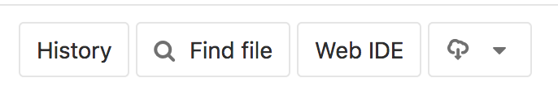

# Building your own pipeline

The goal of this pratical is to walk you through the nextflow pipeline building process you will learn:

- How to use this [git repository (LBMC/nextflow)](https://gitbio.ens-lyon.fr/LBMC/nextflow) as a template for your project.
- The basis of [Nextflow](https://www.nextflow.io/) the pipeline manager that we use at the lab.
- How to build a simple pipeline for the transcript level quantification of RNASeq data
- How to run the exact same pipeline on a computing center ([PSMN](http://www.ens-lyon.fr/PSMN/doku.php))

This guide assumes that you followed the [Git basis, trainning course](https://gitbio.ens-lyon.fr/LBMC/hub/formations/git_basis).

# Initialize your own project

You are going to build a pipeline for you or your team. So the first step is to create your own project.

## Forking

Instead of reinventing the wheel, you can use the [LBMC/nextflow](https://gitbio.ens-lyon.fr/LBMC/nextflow) as a template.
To easily do so, go to the [LBMC/nextflow](https://gitbio.ens-lyon.fr/LBMC/nextflow) repository and click on the [**fork**](https://gitbio.ens-lyon.fr/LBMC/nextflow/forks/new) button (you need to log-in).


In git, the [action of forking](https://git-scm.com/book/en/v2/GitHub-Contributing-to-a-Project) means that you are going to make your own private copy of a repository.
This repository will keep a link with the original [LBMC/nextflow](https://gitbio.ens-lyon.fr/LBMC/nextflow) project from which you will be able to

- [get updates](https://gitbio.ens-lyon.fr/LBMC/nextflow#getting-the-last-updates) [LBMC/nextflow](https://gitbio.ens-lyon.fr/LBMC/nextflow) from the repository
- propose update (see [contributing guide](https://gitbio.ens-lyon.fr/LBMC/nextflow/-/blob/master/CONTRIBUTING.md#forking))


## Project organisation

This project (and yours) follows the [guide of good practices for the LBMC](http://www.ens-lyon.fr/LBMC/intranet/services-communs/pole-bioinformatique/ressources/good_practice_LBMC)

You are now on the main page of your fork of the [LBMC/nextflow](https://gitbio.ens-lyon.fr/LBMC/nextflow). You can explore this project, all the code in it is under the CeCILL licence (in the [LICENCE](https://gitbio.ens-lyon.fr/LBMC/nextflow/blob/master/LICENSE) file).

The [README.md](https://gitbio.ens-lyon.fr/LBMC/nextflow/blob/master/README.md) file contains instructions to run your pipeline and test its installation.

The [CONTRIBUTING.md](https://gitbio.ens-lyon.fr/LBMC/nextflow/blob/master/CONTRIBUTING.md) file contains guidelines if you want to contribute to the [LBMC/nextflow](https://gitbio.ens-lyon.fr/LBMC/nextflow).

The [data](https://gitbio.ens-lyon.fr/LBMC/nextflow/tree/master/data) folder will be the place where you store the raw data for your analysis.
The [results](https://gitbio.ens-lyon.fr/LBMC/nextflow/tree/master/results) folder will be the place where you store the results of your analysis.

> **The content of `data` and `results` folders should never be saved on git.**

The [doc](https://gitbio.ens-lyon.fr/LBMC/nextflow/tree/master/doc) folder contains the documentation and this guide.

And most interestingly for you, the [src](https://gitbio.ens-lyon.fr/LBMC/nextflow/tree/master/src) contains code to wrap tools. This folder contains one visible subdirectories `nf_modules` some pipeline examples and other hidden folder and files.

# Nextflow pipeline

A pipeline is a succession of [**process**](https://www.nextflow.io/docs/latest/process.html#process-page). Each `process` has data input(s) and optional data output(s). Data flows are modeled as [**channels**](https://www.nextflow.io/docs/latest/channel.html).

## Processes

Here is an example of **process**:

```Groovy
process sample_fasta {
  input:
  file fasta

  output:
  file "sample.fasta", emit: fasta_sample

  script:
"""
head ${fasta} > sample.fasta
"""
}
```

We have the process `sample_fasta` that takes fasta `file` input and as output a fasta `file`. The `process` task itself is defined in the `script:` block and within `"""`.

```Groovy
input:
file fasta
```

When we zoom on the `input:` block we see that we define a variable `fasta` of type `file`.
This mean that the `sample_fasta` `process` is going to get a flux of fasta file(s).
Nextflow is going to write a file named as the content of the variable `fasta` in the root of the folder where `script:` is executed.

```Groovy
output:
file "sample.fasta", emit: fasta_sample
```

At the end of the script, a file named `sample.fasta` is found in the root the folder where `script:` is executed and will be emited as `fasta_sample`.

Using the WebIDE of Gitlab, create a file `src/fasta_sampler.nf` with this process and commit it to your repository.



## Workflow

In Nexflow, `process` blocks are chained together within a `workflow` block.
For the time beeing, we only have one `process` so `workflow` may look like an unessary complication, but keep in mind that we want to be able to write complex bioinformatic pipeline.

```
workflow {
  take:
   fasta_files

  main:
    sample_fasta(fasta_file)
}
```

Like `process` blocks `workflow` can take some imputs:

```
  take:
   fasta_files
```

and transmit this input to `process`es

```
  main:
    sample_fasta(fasta_file)
```

The `main:` block is where we are goint to call our `process`(es)
Add the definition of the `workflow` to the `src/fasta_sampler.nf` file and commit it to your repository.

## Channels

Why bother with `channel`s? In the above example, the advantages of `channel`s are not really clear. We could have just given the `fasta` file to the `workflow`. But what if we have many fasta files to process? What if we have sub processes to run on each of the sampled fasta files? Nextflow can easily deal with these problems with the help of `channel`s.

> **Channels** are streams of items that are emitted by a source and consumed by a process. A process with a `channel` as input will be run on every item send through the `channel`.

```Groovy
channel
  .fromPath( "data/tiny_dataset/fasta/*.fasta" )
  .set { fasta_file }
```

Here we defined the `channel`, `fasta_file`, that is going to send every fasta file from the folder `data/tiny_dataset/fasta/` into the process that take it as input.

Add the definition of the `channel`, above the `workflow` block, to the `src/fasta_sampler.nf` file and commit it to your repository.

## Run your pipeline locally

After writing this first pipeline, you may want to test it. To do that, first clone your repository.
After following the [Git basis, trainning course](https://gitbio.ens-lyon.fr/LBMC/hub/formations/git_basis), you should have an up to date `ssh` configuration to connect to the `gitbio.ens-lyon.fr` git server.

You can then run the following commands to download your project on your computer:

and then :

```sh
git clone git@gitbio.ens-lyon.fr:<usr_name>/nextflow.git
cd nextflow
src/install_nextflow.sh
```

We also need data to run our pipeline:

```
cd data
git clone git@gitbio.ens-lyon.fr:LBMC/hub/tiny_dataset.git
cd ..
```

We can run our pipeline with the following command:

```sh
./nextflow src/fasta_sampler.nf
```


## Getting your results

Our pipeline seems to work but we don’t know where is the `sample.fasta`. To get results out of a process, we need to tell nextflow to write it somewhere (we may don’t need to get every intermediate file in our results).

To do that we need to add the following line before the `input:` section:

```Groovy
publishDir "results/sampling/", mode: 'copy'
```

Every file described in the `output:` section will be copied from nextflow to the folder `results/sampling/`.

Add this to your `src/fasta_sampler.nf` file with the WebIDE and commit to your repository.
Pull your modifications locally with the command:

```sh
git pull origin master
```

You can run your pipeline again and check the content of the folder `results/sampling`.

## Fasta everywhere

We ran our pipeline on one fasta file. How would nextflow handle 100 of them? To test that we need to duplicate the `tiny_v2.fasta` file: 

```sh
for i in {1..100}
do
cp data/tiny_dataset/fasta/tiny_v2.fasta data/tiny_dataset/fasta/tiny_v2_${i}.fasta
done
```

You can run your pipeline again and check the content of the folder `results/sampling`.

Every `fasta_sampler` process write a `sample.fasta` file. We need to make the name of the output file dependent of the name of the input file.

```Groovy
output:
file "*_sample.fasta", emit: fasta_sample

  script:
"""
head ${fasta} > ${fasta.simpleName}_sample.fasta
"""
```

Add this to your `src/fasta_sampler.nf` file with the WebIDE and commit it to your repository before pulling your modifications locally.
You can run your pipeline again and check the content of the folder `results/sampling`.


