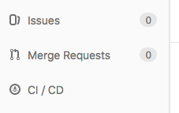

## Projects using nextflow

This page list existing Nextflow based pipeline projects into different categories

- [RNASeq](./nf_projects.md#rnaseq)
- [scRNASeq](./nf_projects.m#scrnaseq)
- [DNASeq](./nf_projects.md#dnaseq)
- [ChipSeq](./nf_projects.md#chipseq)

To add your project to this list, please fork this project, modify this file and make a merge request.

### RNASeq

- [https://_https://gitlab.biologie.ens-lyon.fr/gylab/salmoninyeast](https://_https://gitlab.biologie.ens-lyon.fr/gylab/salmoninyeast)
- [https://github.com/LBMC/readthroughpombe](https://github.com/LBMC/readthroughpombe)
- [https://_https://gitlab.biologie.ens-lyon.fr/vvanoost/nextflow](https://_https://gitlab.biologie.ens-lyon.fr/vvanoost/nextflow)
- [https://gitlab.biologie.ens-lyon.fr/elabaron/HIV_project](https://gitlab.biologie.ens-lyon.fr/elabaron/HIV_project)  
- [https://gitbio.ens-lyon.fr/LBMC/Palladino/RNAseq_nextflow](https://gitbio.ens-lyon.fr/LBMC/Palladino/RNAseq_nextflow)

### scRNASeq

- [https://gitlab.com/LBMC_UMR5239/sbdm/mars-seq](https://gitlab.com/LBMC_UMR5239/sbdm/mars-seq)

### DNASeq

- [https://github.com/LBMC/ChrSexebelari](https://github.com/LBMC/ChrSexebelari)
- [https://gitbio.ens-lyon.fr/LBMC/gylab/MappingNoise](https://gitbio.ens-lyon.fr/LBMC/gylab/MappingNoise)
- [https://gitbio.ens-lyon.fr/LBMC/qrg/droso_hic_group/droso_haplo_rna_seq](https://gitbio.ens-lyon.fr/LBMC/qrg/droso_hic_group/droso_haplo_rna_seq)

### Chip-Seq

- [https://gitlab.biologie.ens-lyon.fr/Auboeuf/ChIP-seq](https://gitlab.biologie.ens-lyon.fr/Auboeuf/ChIP-seq)
- [https://gitbio.ens-lyon.fr/LBMC/Bernard/quantitative-nucleosome-analysis](https://gitbio.ens-lyon.fr/LBMC/Bernard/quantitative-nucleosome-analysis)

